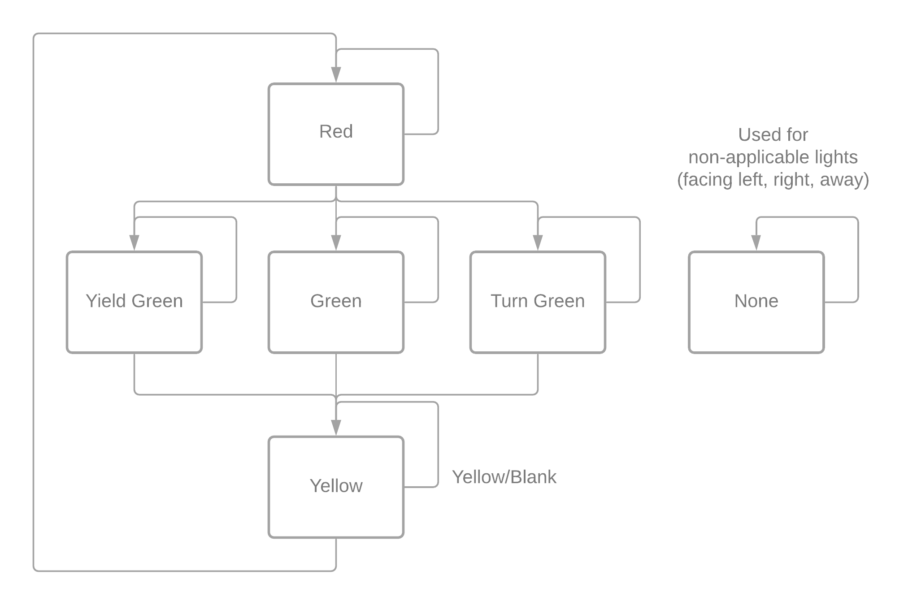
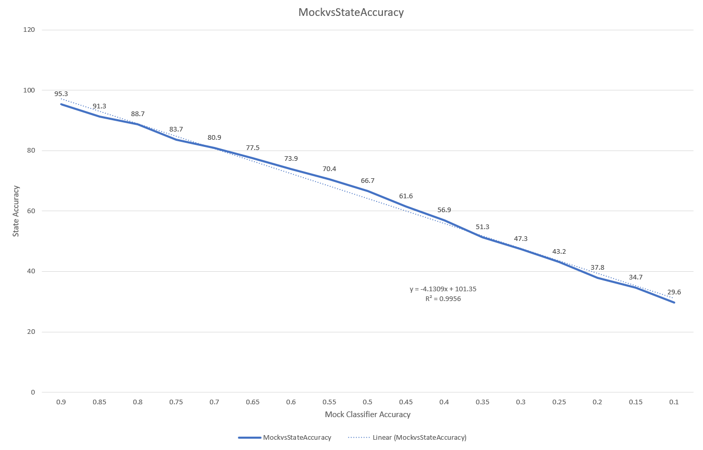

# Traffic Light Finite State Machine
This is a finite state machine created centered around the actions of Traffic Lights. In continued research of autonomous vehicles, there is an explicit need to properly categorize the traffic lights in order to allow the vehicle to make the appropriate decisions. 

To ward off the inherent noise of directly feeding network classifications to planning modules, the intermediate step of a state machine is used to guard against innacurate classifications that break the traditional traffic flow. 

It works by maintaining the flow under normal circumstances (Red State, Green Input) the state machine will immediately change. And each time there is a reading that does not fit the current flow (ie Green State, Red Input) it will instead of simply changing, count how many flow breaking entries were input in a row so far. If the number exceeds 1, then the flow will break and the state will be changed to Red.

## Data Generation
Usage: `python data_generation.py -o <outputFile to write to> -a <accuracy of mock model>`

This script will write 10,000 samples of the generated data to the data file specified in the following format.

 - TrueState - Ground truth state of the traffic light
 - MockClassification - Noisy output of the mock classification based on true state and accuracy
- StateStatus - Status of the light stored in the finite state machine
`TrueState,MockClassification,StateStatus`

## Results

This graph shows the performance of the finite state machine given various mock classifier accuracies resulting in randomly assigning a traffic light class. 

Each plot points accuracy is determined from 10,000 generated data samples at the given Mock Classifier Accuracy with a total of 160,000 samples. Every 1% drop in mock classifier accuracy results in a 0.8% drop in state accuracy. As a result of this the increased performance by the state intermediary ranges from a 5% performance increase @ 95% accuracy to a 20% performance increase @ 10% accuracy. 

Assuming a 10hz capture rate for images for over 10,000 data points this state machine could provide up to 200 seconds of correct data when the raw predictions from the classifiers are incorrect. 